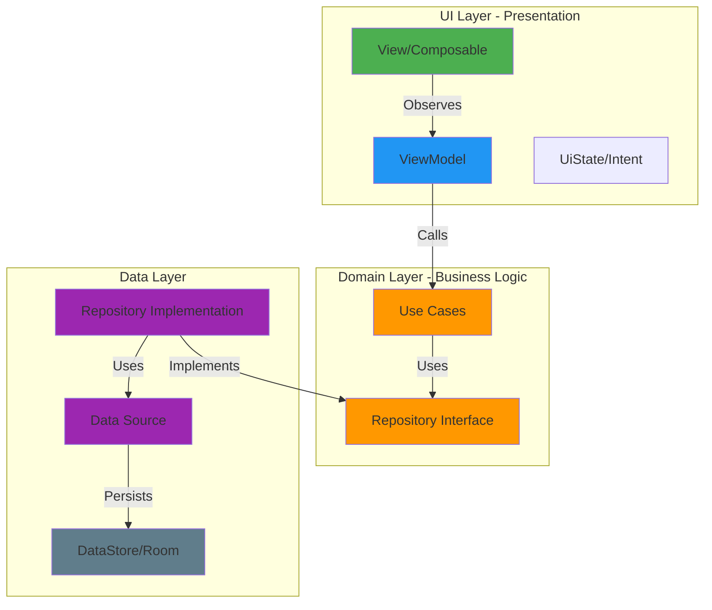
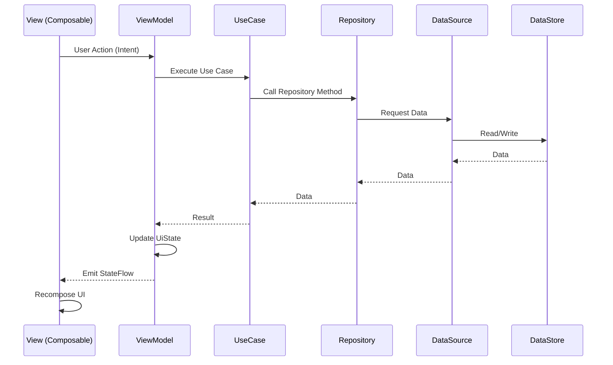
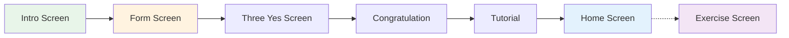
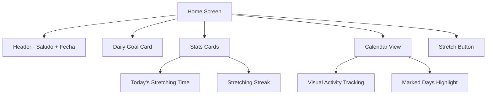

# 📱 Stretch Reminder

<div align="center">


**Una aplicación Android moderna para recordatorios de estiramiento personalizados que ayuda a combatir el sedentarismo laboral**

[Características](#-características-principales) •
[Arquitectura](#%EF%B8%8F-arquitectura) •
[Tecnologías](#-stack-tecnológico) •
[Instalación](#-instalación)

</div>

---

## 📋 Descripción

**Stretch Reminder** es una aplicación móvil nativa de Android que ayuda a mejorar la salud y el bienestar de los usuarios mediante recordatorios de estiramiento personalizados durante su jornada laboral. La app combina un diseño moderno con una experiencia gamificada para motivar hábitos saludables.

### 🎯 Objetivo

Combatir los efectos negativos del sedentarismo laboral, especialmente para personas que pasan muchas horas en una misma postura, ofreciendo:
- Recordatorios inteligentes basados en horario laboral
- Rutinas de estiramiento personalizadas
- Seguimiento de progreso y gamificación
- Experiencia visual atractiva

---

## ✨ Características Principales

### 🔧 Funcionalidades

- **Onboarding Personalizado**
  - Formulario interactivo con preguntas sobre edad, género, postura de trabajo
  - Configuración de días y horarios laborales
  - Selección de partes del cuerpo problemáticas
  - Frecuencia de recordatorios personalizada

- **Sistema de Recordatorios**
  - Notificaciones inteligentes durante horas de trabajo
  - Basado en la postura y necesidades del usuario
  - Respeta días no laborables configurados

- **Tracking y Gamificación**
  - Sistema de logros y recompensas
  - Racha de días (Streak tracking)
  - Calendario visual de actividad
  - Estadísticas de tiempo de estiramiento

- **Videos de Ejercicios**
  - Reproducción de videos con ExoPlayer
  - Guías visuales de estiramientos
  - Adaptados a partes del cuerpo seleccionadas

- **Experiencia Premium**
  - Animaciones fluidas con Lottie
  - Transiciones modernas
  - Diseño Material3
  - Edge-to-edge UI

---

## 🏗️ Arquitectura

El proyecto implementa **Clean Architecture** combinada con el patrón **MVVM**, siguiendo las mejores prácticas de desarrollo Android moderno.

### 📐 Diagrama de Capas



### 🔄 Flujo de Datos



### 📦 Estructura del Proyecto

```
com.fpstudio.stretchreminder/
│
├── 📂 data/                    # Capa de Datos
│   ├── datasource/            # Fuentes de datos (Local/Remote)
│   │   └── UserLocalDataSource.kt
│   ├── mapper/                # Conversión entre capas
│   ├── model/                 # Modelos de datos
│   │   └── User.kt
│   └── repository/            # Implementación de repositorios
│       └── UserRepositoryImpl.kt
│
├── 📂 domain/                  # Capa de Dominio
│   ├── repository/            # Contratos de repositorios
│   │   └── UserRepository.kt
│   └── usecase/               # Casos de uso
│       ├── GetUserUseCase.kt
│       └── SaveUserUseCase.kt
│
├── 📂 ui/                      # Capa de Presentación
│   ├── screen/                # Pantallas
│   │   ├── intro/
│   │   ├── form/
│   │   ├── home/
│   │   ├── tutorial/
│   │   └── exercise/
│   ├── component/             # Componentes de negocio
│   ├── composable/            # Composables reutilizables
│   │   ├── button/
│   │   ├── calendar/
│   │   ├── transitions/
│   │   └── permission/
│   └── theme/                 # Tema y estilos
│
└── 📂 util/                    # Utilidades
    └── di/                    # Inyección de dependencias
        ├── appModule.kt
        └── userModule.kt
```

---

## 🛠 Stack Tecnológico

### Core

| Tecnología | Versión | Uso |
|------------|---------|-----|
| **Kotlin** | 2.2.0 | Lenguaje principal |
| **Jetpack Compose** | Latest | UI declarativa moderna |
| **Material3** | Latest | Design system |
| **Compose BOM** | Latest | Gestión de versiones |

### Arquitectura & Patterns

| Librería | Propósito |
|----------|-----------|
| **Koin** | Inyección de dependencias |
| **Navigation Compose** | Navegación type-safe |
| **Kotlin Serialization** | Serialización de rutas |
| **Coroutines** | Programación asíncrona |
| **StateFlow** | Reactive state management |

### Persistencia

| Librería | Uso |
|----------|-----|
| **Room Database** | Base de datos local SQL |
| **DataStore Preferences** | Almacenamiento key-value |
| **Gson** | Serialización JSON |

### Media & UI

| Librería | Propósito |
|----------|-----------|
| **ExoPlayer (Media3)** | Reproducción de videos |
| **Lottie Compose** | Animaciones complejas |
| **ConstraintLayout Compose** | Layouts complejos |
| **Core SplashScreen** | Splash screen nativa |

### Versiones Android

```kotlin
compileSdk = 36
minSdk = 26
targetSdk = 36
```

---

## 📱 Flujo de Navegación



### Pantallas Detalladas

#### 1️⃣ **Intro Screen**
- Pantalla de bienvenida
- Presentación del valor de la app
- CTA: "Feel Better Now"
- Términos y condiciones

#### 2️⃣ **Form Screen** (Onboarding)
Formulario multipágina con:
- Información personal (edad, género)
- Configuración laboral (días, horarios)
- Postura principal (sentado/de pie/acostado)
- Partes del cuerpo con tensión
- Frecuencia deseada
- Solicitud de permisos de notificación

**Características técnicas:**
- `HorizontalPager` para navegación fluida
- Barra de progreso visual
- Persistencia de progreso
- Validación de respuestas

#### 3️⃣ **Three Yes Screen**
- Refuerzo de beneficios
- Preparación psicológica

#### 4️⃣ **Congratulation Screen**
- Animación Lottie de celebración
- Feedback positivo
- Transición a tutorial

#### 5️⃣ **Tutorial Screen**
- Video tutorial interactivo
- Explicación de funcionalidades
- Guía de uso

#### 6️⃣ **Home Screen** (Principal)



**Elementos:**
- **Header**: Saludo personalizado con nombre y fecha
- **Daily Goal Card**: Progreso diario con indicador visual
- **Info Cards**: 
  - Tiempo de estiramiento hoy
  - Racha de días consecutivos
- **Calendario**: Visualización mensual con días activos
- **Botón principal**: Iniciar sesión de estiramiento

#### 7️⃣ **Exercise Screen**
- Reproducción de videos de ejercicios
- Temporizador
- Controles de reproducción

---

## 🗂 Detalles de Implementación

### Capa de Datos

#### DataSource
```kotlin
class UserLocalDataSource(private val context: Context) {
    private val gson = Gson()
    
    suspend fun saveUser(user: User) {
        context.dataStore.edit {
            val userJson = gson.toJson(user)
            it[USER_KEY] = userJson
        }
    }
    
    suspend fun getUser(): User? {
        val user = context.dataStore.data.first()
        val userJson = user[USER_KEY]
        return gson.fromJson(userJson, User::class.java)
    }
}
```

#### Repository Implementation
```kotlin
class UserRepositoryImpl(
    private val localDataSource: UserLocalDataSource
) : UserRepository {
    override suspend fun saveUser(user: User) {
        localDataSource.saveUser(user)
    }
    
    override suspend fun getUser(): User? = localDataSource.getUser()
}
```

### Capa de Dominio

#### Use Cases
```kotlin
class GetUserUseCase(private val repository: UserRepository) {
    suspend operator fun invoke(): User? = repository.getUser()
}

class SaveUserUseCase(private val repository: UserRepository) {
    suspend operator fun invoke(user: User) {
        repository.saveUser(user)
    }
}
```

### Capa de Presentación

#### ViewModel Pattern
```kotlin
class FormViewModel(
    private val saveUserUseCase: SaveUserUseCase,
    private val getUserUseCase: GetUserUseCase
) : ViewModel() {
    
    private val _uiState = MutableStateFlow(UiState())
    val uiState: StateFlow<UiState> = _uiState.asStateFlow()
    
    fun handleIntent(intent: Intent) {
        when (intent) {
            is Intent.OnContinueClick -> onContinue()
            is Intent.OnBackClick -> onBack()
            // ...
        }
    }
}
```

#### Screen Composable
```kotlin
@Composable
fun FormScreen(
    viewmodel: FormViewModel = koinViewModel(),
    onNavigate: () -> Unit
) {
    val uiState = viewmodel.uiState.collectAsStateWithLifecycle()
    
    FormScreenContent(
        uiState = uiState.value,
        onIntent = viewmodel::handleIntent,
        onNavigate = onNavigate
    )
}
```

### Inyección de Dependencias (Koin)

```kotlin
// userModule.kt
val userModule = module {
    single { UserLocalDataSource(androidContext()) }
    single<UserRepository> { UserRepositoryImpl(get()) }
    factory { SaveUserUseCase(get()) }
    factory { GetUserUseCase(get()) }
}

// appModule.kt
val appModule = module {
    viewModel { FormViewModel(get(), get()) }
    viewModelOf(::HomeViewModel)
    viewModelOf(::TutorialViewModel)
}

// MainApplication.kt
class MainApplication: Application() {
    override fun onCreate() {
        super.onCreate()
        startKoin {
            androidLogger()
            androidContext(this@MainApplication)
            modules(appModule, userModule)
        }
    }
}
```

---

## 📊 Modelo de Datos

### User Model

```kotlin
data class User(
    val name: String = "",
    val lastFormPage: Int = 0,
    val gender: String = "",
    val ageRange: String = "",
    val mainPosture: Int = 0,
    val workDays: List<String> = emptyList(),
    val achievement: List<UserAchievement> = emptyList(),
    val startTime: Long = 0L,
    val endTime: Long = 0L,
    val bodyParts: List<BodyPartID> = emptyList(),
    val frequency: Int = 0,
    val tutorialDone: Boolean = false,
    val notificationPermission: Boolean = false
)
```

### Body Parts

```kotlin
enum class BodyPartID {
    NECK,        // Cuello
    SHOULDERS,   // Hombros
    ARMS,        // Brazos
    TRAPEZOIDS,  // Trapecio
    LOWER_BACK,  // Espalda baja
    HANDS,       // Manos
    HIP,         // Caderas
    LEGS,        // Piernas
    All          // Todas las áreas
}
```

---

## 🚀 Instalación

### Prerrequisitos

- Android Studio Hedgehog | 2023.1.1 o superior
- JDK 11 o superior
- SDK de Android 26 (Oreo) o superior
- Gradle 8.0+

### Pasos

1. **Clonar el repositorio**
   ```bash
   git clone https://github.com/yourusername/strechreminder.git
   cd strechreminder
   ```

2. **Abrir en Android Studio**
   ```
   File > Open > Seleccionar la carpeta del proyecto
   ```

3. **Sincronizar Gradle**
   ```
   Gradle sync automático o:
   File > Sync Project with Gradle Files
   ```

4. **Configurar emulador o dispositivo**
   - Emulador: API 26+ (Android 8.0+)
   - Dispositivo físico con USB debugging habilitado

5. **Ejecutar la aplicación**
   ```
   Shift + F10 (Windows/Linux)
   Control + R (Mac)
   ```

### Configuración de Local Properties

Crear `local.properties` en la raíz del proyecto:
```properties
sdk.dir=/path/to/your/Android/sdk
```

---

## 🎨 Recursos Visuales

### Assets Incluidos

#### Animaciones Lottie
- `congratulations.json` - Celebración de logros
- `back.json` / `back_white.json` - Botón de retroceso animado
- `search.lottie` - Indicador de búsqueda

#### Videos
- `onboarding.mp4` - Video introductorio (5.4 MB)
- `tutorial.mp4` - Guía de uso (3.5 MB)

#### Imágenes
- Ilustraciones de género (male/female)
- Partes del cuerpo seleccionables
- Iconos de posturas (sentado, de pie, acostado)
- Iconos personalizados (reloj, fuego, campana, etc.)

---

## 🔐 Permisos

```xml
<uses-permission android:name="android.permission.INTERNET" />
<uses-permission android:name="android.permission.POST_NOTIFICATIONS" />
<uses-permission android:name="android.permission.VIBRATE" />
```

| Permiso | Justificación |
|---------|---------------|
| `INTERNET` | Futura sincronización en la nube |
| `POST_NOTIFICATIONS` | Recordatorios de estiramiento |
| `VIBRATE` | Feedback táctil |

---

## 📈 Estado del Proyecto

### ✅ Completado

- [x] Arquitectura Clean + MVVM
- [x] Onboarding completo con formulario
- [x] Sistema de navegación type-safe
- [x] Pantalla Home con estadísticas
- [x] Integración DataStore
- [x] Animaciones y transiciones
- [x] Splash Screen
- [x] Inyección de dependencias

### 🚧 En Desarrollo

- [ ] Pantalla de ejercicios completa
- [ ] Sistema de notificaciones programadas
- [ ] Algoritmo de recordatorios inteligentes
- [ ] Base de datos Room para ejercicios
- [ ] Tests unitarios y de integración
- [ ] Sincronización en la nube

### 🎯 Roadmap Futuro

- [ ] Widget de recordatorio
- [ ] Modo oscuro completo
- [ ] Sincronización multi-dispositivo
- [ ] Estadísticas avanzadas
- [ ] Planes de estiramiento personalizados
- [ ] Integración con wearables
- [ ] Logros y badges
- [ ] Comunidad y compartir logros

---

## 🧪 Testing

### Estructura de Tests
```
src/
├── test/               # Unit tests
└── androidTest/        # Integration tests
```

### Ejecutar Tests
```bash
# Unit tests
./gradlew test

# Android instrumented tests
./gradlew connectedAndroidTest
```

---

## 🏛 Principios de Diseño

### SOLID Principles

✅ **Single Responsibility**: Cada clase tiene una única responsabilidad  
✅ **Open/Closed**: Abierto a extensión, cerrado a modificación  
✅ **Liskov Substitution**: Interfaces implementadas correctamente  
✅ **Interface Segregation**: Interfaces específicas y cohesivas  
✅ **Dependency Inversion**: Dependencias hacia abstracciones  

### Clean Code

- Nombres descriptivos y significativos
- Funciones pequeñas y enfocadas
- Inmutabilidad preferida
- Manejo explícito de errores
- Código autodocumentado

---

## 📖 Recursos y Referencias

### Documentación Oficial

- [Android Developers](https://developer.android.com)
- [Jetpack Compose](https://developer.android.com/jetpack/compose)
- [Kotlin Documentation](https://kotlinlang.org/docs/home.html)
- [Koin](https://insert-koin.io/)

### Arquitectura

- [Guide to App Architecture](https://developer.android.com/topic/architecture)
- [Clean Architecture (Uncle Bob)](https://blog.cleancoder.com/uncle-bob/2012/08/13/the-clean-architecture.html)

---

## 👨‍💻 Desarrollo

### Convenciones de Código

- **Estilo de código**: [Kotlin Coding Conventions](https://kotlinlang.org/docs/coding-conventions.html)
- **Commits**: Conventional Commits
- **Branches**: GitFlow

### Build Variants

```kotlin
buildTypes {
    release {
        isMinifyEnabled = false
        proguardFiles(...)
    }
    debug {
        applicationIdSuffix = ".debug"
    }
}
```

---

## 📄 Licencia

Este proyecto es privado y pertenece a FP Studio.

---

## 🤝 Contribución

Para contribuir al proyecto:

1. Crear una rama feature: `git checkout -b feature/nueva-funcionalidad`
2. Hacer commits descriptivos
3. Push a la rama: `git push origin feature/nueva-funcionalidad`
4. Crear Pull Request

---

## 📞 Contacto

**FP Studio**  
Email: [stretchremindercoach@gmail.com](mailto:stretchremindercoach@gmail.com)

---

<div align="center">

**Hecho con ❤️ usando Kotlin y Jetpack Compose**

⭐️ Si te gusta este proyecto, considera darle una estrella

</div>
